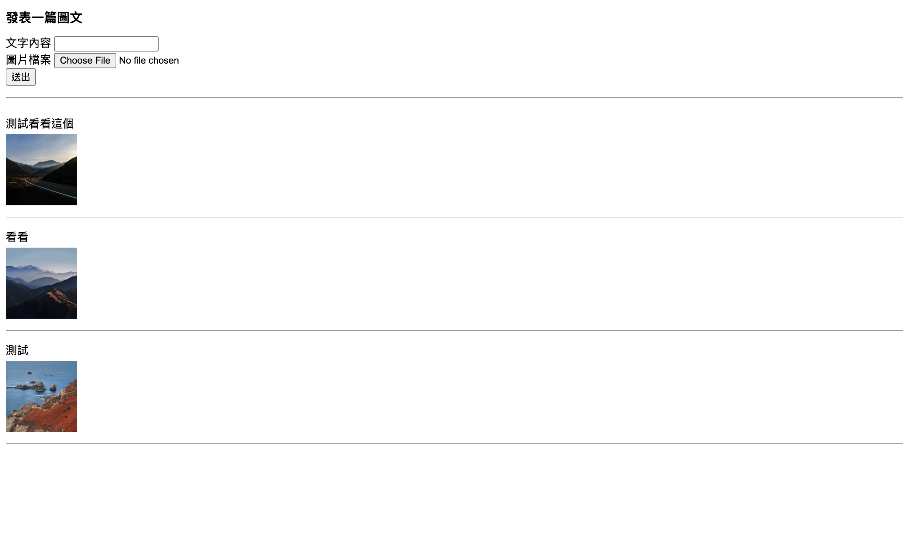
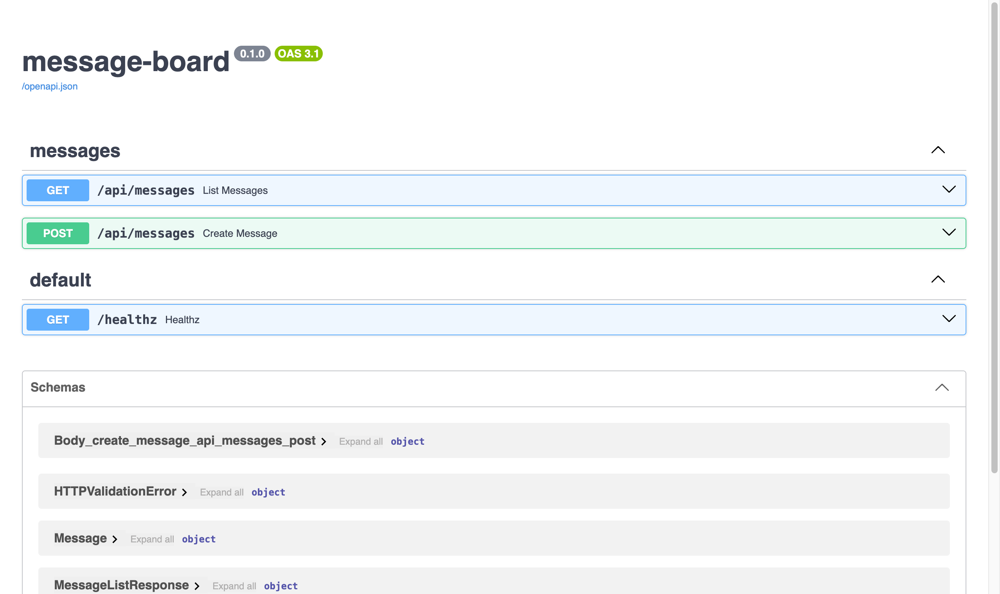

# 零基礎教學：FastAPI 圖文留言板 × AWS（S3、CloudFront、RDS、EC2）× Docker × 自動部署

> 給完全沒碰過後端和 AWS 的人。照順序做，每一步都寫了「打什麼、點哪裡、應該看到什麼」。
> 本文程式碼都實際跑過：Ruff 檢查、13 個測試全過；本機模擬模式實際發文成功；Docker image 用 `linux/amd64` 建置並實際啟動、上傳成功。
> AWS、Cloudflare、GitHub、Docker Hub 的後台步驟會寫出每一個要點的按鈕，並附上官方文件連結（官方文件裡有截圖）。AWS 介面常改版，按鈕名稱跟這裡不完全一樣時，以官方文件為準。

---

## 目錄

0. [你會做出什麼](#0-你會做出什麼)
1. [先看懂這些名詞](#1-先看懂這些名詞)
2. [安裝工具](#2-安裝工具)
3. [本機開發：先不碰 AWS](#3-本機開發先不碰-aws)
4. [寫程式](#4-寫程式)
5. [測試](#5-測試)
6. [Docker：把程式裝進貨櫃](#6-docker把程式裝進貨櫃)
7. [AWS：註冊與安全設定](#7-aws註冊與安全設定)
8. [AWS：S3 存圖片](#8-awss3-存圖片)
9. [AWS：CloudFront 發送圖片](#9-awscloudfront-發送圖片)
10. [AWS：IAM Role 給 EC2 上傳權限](#10-awsiam-role-給-ec2-上傳權限)
11. [AWS：EC2 伺服器](#11-awsec2-伺服器)
12. [AWS：RDS 資料庫](#12-awsrds-資料庫)
13. [第一次手動部署](#13-第一次手動部署)
14. [網域：Cloudflare DNS](#14-網域cloudflare-dns)
15. [GitHub + CI/CD 自動部署](#15-github--cicd-自動部署)
16. [繳交](#16-繳交)
17. [卡關了怎麼辦](#17-卡關了怎麼辦)
18. [省錢與收尾](#18-省錢與收尾)
19. [參考其他同學的作品](#19-參考其他同學的作品)

---

## 0. 你會做出什麼



輸入文字、選一張圖片、按「送出」，新留言出現在最上面。

### 架構

```
                       ┌──────────── EC2（一台雲端電腦）────────────┐
 使用者 ──發文──▶ board.antoney.com ──▶ Docker container（FastAPI）
                                         │            │
                                   存文字│            │存圖片
                                         ▼            ▼
                                   RDS（MySQL）     S3（硬碟）
                                                      │
 使用者 ◀──────────── 看圖片 ──────────── CloudFront（CDN）
```

- **文字**存在 RDS；**圖片**存在 S3，資料庫只記圖片的檔名。
- 使用者看圖片時，**直接向 CloudFront 拿**，不經過我們的伺服器。
- S3 不對外開放，只有 CloudFront 讀得到。

### 做的順序

先在本機把程式寫好、測好（**完全不用 AWS，也不花錢**），再一個一個開 AWS 服務，最後接上網域和自動部署。

| 階段 | 時間 |
|---|---|
| 安裝工具、本機寫程式、測試 | 4–6 小時 |
| AWS 設定 | 2–3 小時（第一次會比較久） |
| 部署、網域、CI/CD | 1–2 小時 |

---

## 1. 先看懂這些名詞

| 名詞 | 白話解釋 |
|---|---|
| **後端** | 在伺服器上跑的程式，負責存資料、處理請求。使用者看不到它。 |
| **API** | 後端開給前端呼叫的「窗口」。例如 `GET /api/messages` = 給我所有留言。 |
| **HTTP 方法** | `GET` 拿資料、`POST` 新增資料。 |
| **狀態碼** | 回應的結果代號：`200` 成功、`201` 新增成功、`400` 你送的資料有問題、`500` 伺服器出錯。 |
| **JSON** | 前後端交換資料的格式，長得像 `{"content": "哈囉"}`。 |
| **FastAPI** | Python 的 API 框架，寫法簡潔，還會自動產生 API 文件頁面。 |
| **虛擬環境（venv）** | 每個 Python 專案自己一份套件，不會互相干擾。 |
| **資料庫 / SQL** | 存資料的地方 / 操作資料庫的語言。 |
| **環境變數** | 不寫在程式碼裡的設定，例如資料庫密碼。程式執行時才讀取。 |
| **AWS** | Amazon 的雲端服務，可以租電腦、硬碟、資料庫。 |
| **Region（區域）** | AWS 機房的位置，例如東京 `ap-northeast-1`。**這次所有服務都開在同一個區域。** |
| **S3** | AWS 的雲端硬碟，存檔案用。裡面的資料夾叫 **bucket**，檔案叫 **object**。 |
| **CDN / CloudFront** | 把檔案複製到全世界的節點，使用者從最近的節點拿，比較快。CloudFront 是 AWS 的 CDN。 |
| **RDS** | AWS 幫你管理的資料庫（這次用 MySQL），不用自己裝、自己備份。 |
| **EC2** | AWS 的雲端電腦，24 小時開著跑你的程式。 |
| **IAM** | AWS 的權限管理。**Role（角色）**可以掛在 EC2 上，讓它有權限上傳 S3，不用把密碼寫在程式裡。 |
| **Security Group** | EC2、RDS 的防火牆，設定誰可以連哪個 port。 |
| **Docker** | 把程式和它需要的環境打包成 **image**（映像檔），在任何電腦上跑起來就是一個 **container**（容器）。「我電腦可以跑，伺服器上也一定可以」。 |
| **Docker Hub** | 放 Docker image 的網站，像 GitHub 之於程式碼。 |
| **DNS** | 網域的電話簿，把 `board.antoney.com` 翻譯成 EC2 的 IP。 |
| **CI/CD** | 每次 push 自動檢查（CI），通過後自動部署（CD）。 |

---

## 2. 安裝工具

### 2.1 VS Code 與 Git

跟前端教學一樣：裝 [VS Code](https://code.visualstudio.com/)，終端機打 `git --version` 確認有 Git。VS Code 另外裝 **Python** 和 **Ruff** 兩個擴充套件。

### 2.2 Python 3.12

到 https://www.python.org/downloads/ 下載 **3.12.x** 的 macOS installer 安裝，然後重開終端機：

```bash
python3.12 --version
```

看到 `Python 3.12.x` 就對了。（3.10 以上本機都能跑，但跟 Docker、CI 用同一版最不容易出怪問題。）

### 2.3 Docker Desktop

1. 到 https://www.docker.com/products/docker-desktop/ 下載 **Mac（Apple 晶片或 Intel，看你的電腦）**版本安裝。
2. 打開 Docker Desktop，等左下角變成綠色 **Engine running**。
3. 終端機：

```bash
docker run --rm hello-world
```

看到 `Hello from Docker!` 就對了。

### 2.4 帳號

| 帳號 | 用途 | 什麼時候要 |
|---|---|---|
| GitHub | 放程式碼、跑 CI/CD | 現在 |
| Docker Hub（https://hub.docker.com/） | 放 Docker image | §13 |
| AWS | 雲端服務 | §7 |
| Cloudflare | 網域（你已經買好 `antoney.com`） | §14 |

---

## 3. 本機開發：先不碰 AWS

本機用兩個「替身」，不需要 AWS 帳號就能完整開發：

| 線上 | 本機替身 |
|---|---|
| RDS（MySQL） | SQLite：一個檔案就是一個資料庫，Python 內建 |
| S3 | moto：在你電腦上假裝成 S3 的程式 |

程式碼完全一樣，只是**環境變數不同**。這也是 clean code 的重點：**設定和程式分開**。

### 3.1 建立專案環境

> 如果你是 clone 這個 repo，裡面已經有 Dockerfile、CI 設定和 `/healthz`。下面照做會把檔案補齊成完整版本。

```bash
cd ~/Desktop/wehelp-frontend/backend   # 換成你的路徑
code .
python3.12 -m venv .venv               # 建虛擬環境
source .venv/bin/activate              # 啟用；之後提示字元前面會多 (.venv)
```

**每次開新終端機都要重新 `source .venv/bin/activate`。**

### 3.2 套件清單

`requirements.txt`（線上要用的）：

```
fastapi==0.142.2
uvicorn[standard]==0.54.0
python-multipart==0.0.32
pydantic-settings==2.15.0
SQLAlchemy==2.0.54
PyMySQL==1.2.3
cryptography==50.0.2
boto3==1.43.108
```

| 套件 | 做什麼 |
|---|---|
| fastapi | API 框架 |
| uvicorn | 跑 FastAPI 的伺服器 |
| python-multipart | 讓 FastAPI 收得到表單和上傳的檔案 |
| pydantic-settings | 讀環境變數，順便檢查型別 |
| SQLAlchemy | 連資料庫；同一份 SQL 可以跑在 SQLite 和 MySQL |
| PyMySQL + cryptography | 連 MySQL 的驅動程式；MySQL 8 的密碼驗證需要 cryptography |
| boto3 | AWS 官方 Python 套件，操作 S3 |

`requirements-dev.txt`（只有開發、測試要用的）：

```
-r requirements.txt
pytest==9.1.1
httpx2==2.13.1
ruff==0.16.10
moto[s3]==5.2.3
```

**版本號全部寫死**（`==`），今天裝和三個月後裝會是同一版，不會突然壞掉。

安裝：

```bash
pip install -r requirements-dev.txt "moto[server]==5.2.3"
```

（`moto[server]` 是本機模擬 S3 用的伺服器，只在你電腦上用，所以不寫進 requirements。）

### 3.3 專案結構

```
backend/
├── app/
│   ├── main.py          ← 程式進入點：建立 app、註冊路由
│   ├── config.py        ← 讀環境變數
│   ├── errors.py        ← 統一的錯誤格式
│   ├── database.py      ← 資料庫存取
│   ├── storage.py       ← S3 上傳、圖片網址
│   ├── messages.py      ← /api/messages 兩支 API
│   └── static/          ← 留言板網頁
│       ├── index.html
│       ├── style.css
│       └── app.js
├── tests/
├── scripts/dev_setup.py ← 本機模擬模式的初始化
├── schema.sql           ← 建 MySQL 資料表
├── Dockerfile
├── .env.example         ← 線上要填的變數（範本）
└── .env.local.example   ← 本機模擬模式的變數
```

**每個檔案只做一件事。** 要改資料庫只看 `database.py`，要改 S3 只看 `storage.py`。

---

## 4. 寫程式

> 每個檔案都給完整內容。建議自己打一遍，邊打邊看下面的說明。

### 4.1 讀設定：`app/config.py`

```python
from functools import lru_cache

from pydantic_settings import BaseSettings, SettingsConfigDict
from sqlalchemy.engine import URL


class Settings(BaseSettings):
    """從環境變數（或 .env）讀設定，名稱不分大小寫。"""

    model_config = SettingsConfigDict(env_file=".env", extra="ignore")

    db_host: str = "localhost"
    db_port: int = 3306
    db_user: str = "admin"
    db_password: str = ""
    db_name: str = "message_board"
    # 有填就直接用（測試用 SQLite）；沒填就用上面五個欄位組 MySQL 連線
    database_url: str | None = None

    aws_region: str = "ap-northeast-1"
    s3_bucket: str = ""
    # 以下三個只有本機用 moto 模擬 S3 時才填；線上留空，boto3 會自動用 EC2 的 IAM Role
    s3_endpoint_url: str | None = None
    aws_access_key_id: str | None = None
    aws_secret_access_key: str | None = None
    # 圖片網址前綴，線上填 https://dxxxx.cloudfront.net
    cdn_base_url: str = ""

    max_upload_mb: int = 5

    @property
    def sqlalchemy_url(self) -> str | URL:
        if self.database_url:
            return self.database_url
        # 用 URL.create 組，密碼裡有 @、# 等特殊字元也不會壞
        return URL.create(
            "mysql+pymysql",
            username=self.db_user,
            password=self.db_password,
            host=self.db_host,
            port=self.db_port,
            database=self.db_name,
            query={"charset": "utf8mb4"},
        )


@lru_cache
def get_settings() -> Settings:
    return Settings()
```

- `Settings` 每個欄位對應一個環境變數：`db_host` ↔ `DB_HOST`。型別寫 `int` 的，填了文字會直接報錯，**問題在啟動時就被發現**。
- 本機會讀專案裡的 `.env` 檔；在 Docker 裡則由 `docker run --env-file` 傳進來。
- `charset=utf8mb4`：MySQL 的 `utf8` 其實存不了 emoji，要用 `utf8mb4`。中文和 emoji 都正常。
- `@lru_cache`：只讀一次設定，之後都用同一份。
- **程式碼裡沒有任何密碼。** 密碼只存在 `.env`，而 `.env` 不會進 Git。

### 4.2 錯誤格式：`app/errors.py`

```python
import logging

from fastapi import Request
from fastapi.exceptions import RequestValidationError
from fastapi.responses import JSONResponse

logger = logging.getLogger(__name__)


class AppError(Exception):
    """可以直接回給使用者的錯誤：HTTP status + 錯誤代碼 + 中文訊息。"""

    def __init__(self, status_code: int, error: str, message: str) -> None:
        self.status_code = status_code
        self.error = error
        self.message = message


def error_response(status_code: int, error: str, message: str) -> JSONResponse:
    return JSONResponse(status_code=status_code, content={"error": error, "message": message})


async def app_error_handler(_: Request, exc: AppError) -> JSONResponse:
    return error_response(exc.status_code, exc.error, exc.message)


async def validation_error_handler(_: Request, exc: RequestValidationError) -> JSONResponse:
    # FastAPI 預設回 422 + detail，統一改成跟其他錯誤一樣的格式
    return error_response(400, "invalid_request", "送出的資料格式不正確")


async def unexpected_error_handler(_: Request, exc: Exception) -> JSONResponse:
    # 沒預料到的錯誤（例如資料庫掛了）：細節只寫進 log，使用者只看到通用訊息
    logger.exception("Unhandled error", exc_info=exc)
    return error_response(500, "internal_error", "伺服器發生錯誤，請稍後再試")
```

所有錯誤都回傳一樣的格式 `{"error": "代碼", "message": "給人看的訊息"}`，前端只要寫一種處理方式。三個處理器各管一種情況：

| 處理器 | 什麼時候用到 |
|---|---|
| `app_error_handler` | 我們自己 `raise AppError(...)`，例如圖片太大 |
| `validation_error_handler` | 請求格式根本不對（例如 `image` 送的是文字不是檔案），FastAPI 預設會回 422，這裡統一改成 400 |
| `unexpected_error_handler` | 沒預料到的錯誤，例如資料庫掛了。細節寫進 log，使用者只看到通用訊息 |

### 4.3 資料庫：`app/database.py`

```python
from datetime import datetime, timezone
from functools import lru_cache

from sqlalchemy import Engine, create_engine, text

from app.config import get_settings


@lru_cache
def get_engine() -> Engine:
    # pool_pre_ping：RDS 會切掉閒置太久的連線，用之前先確認還活著
    return create_engine(get_settings().sqlalchemy_url, pool_pre_ping=True, pool_recycle=3600)


def insert_message(engine: Engine, content: str, image_key: str) -> dict:
    with engine.begin() as conn:
        result = conn.execute(
            text("INSERT INTO messages (content, image_key) VALUES (:content, :image_key)"),
            {"content": content, "image_key": image_key},
        )
        row = conn.execute(
            text("SELECT id, content, image_key, created_at FROM messages WHERE id = :id"),
            {"id": result.lastrowid},
        ).one()
    return _to_dict(row)


def list_messages(engine: Engine) -> list[dict]:
    with engine.connect() as conn:
        rows = conn.execute(
            # 用 id 排序：同一秒送出的兩則，created_at 會一樣，id 不會
            text("SELECT id, content, image_key, created_at FROM messages ORDER BY id DESC")
        ).all()
    return [_to_dict(row) for row in rows]


def _to_dict(row) -> dict:
    created_at = row.created_at
    if isinstance(created_at, str):  # SQLite 回傳字串，MySQL 回傳 datetime
        created_at = datetime.fromisoformat(created_at)
    return {
        "id": row.id,
        "content": row.content,
        "image_key": row.image_key,
        # RDS 預設時區是 UTC，補上時區資訊讓前端能正確換算
        "created_at": created_at.replace(tzinfo=timezone.utc),
    }
```

- **Engine 是連線池**：事先開好幾條連線重複使用，不用每次請求都重新連，比較快。
- **`:content` 是參數**，值另外傳。**絕對不要用 f-string 把使用者輸入接進 SQL**（例如 `f"... VALUES ('{content}')"`），有人輸入 `'); DROP TABLE messages; --` 你的資料表就沒了，這叫 SQL injection。
- `engine.begin()`：區塊結束時自動 commit，中途出錯自動 rollback。
- `ORDER BY id DESC`：新的在前面。
- 這裡只寫最普通的 SQL，所以同一份程式在 SQLite（本機、測試）和 MySQL（線上）都能跑。

### 4.4 S3：`app/storage.py`

```python
import uuid
from functools import lru_cache

import boto3

from app.config import get_settings

# 檔案開頭的固定位元組（magic number），比瀏覽器送來的 Content-Type 可靠
_SIGNATURES = {
    b"\xff\xd8\xff": ("jpg", "image/jpeg"),
    b"\x89PNG\r\n\x1a\n": ("png", "image/png"),
    b"GIF87a": ("gif", "image/gif"),
    b"GIF89a": ("gif", "image/gif"),
}


def detect_image_type(data: bytes) -> tuple[str, str] | None:
    """回傳 (副檔名, MIME type)；不是支援的圖片格式回傳 None。"""
    if data[:4] == b"RIFF" and data[8:12] == b"WEBP":
        return "webp", "image/webp"
    for signature, image_type in _SIGNATURES.items():
        if data.startswith(signature):
            return image_type
    return None


@lru_cache
def get_s3_client():
    settings = get_settings()
    # 金鑰是 None 時 boto3 會自己找憑證；在 EC2 上就是掛在機器上的 IAM Role
    return boto3.client(
        "s3",
        region_name=settings.aws_region,
        endpoint_url=settings.s3_endpoint_url,
        aws_access_key_id=settings.aws_access_key_id,
        aws_secret_access_key=settings.aws_secret_access_key,
    )


def upload_image(s3, data: bytes, extension: str, content_type: str) -> str:
    key = f"uploads/{uuid.uuid4().hex}.{extension}"
    s3.put_object(
        Bucket=get_settings().s3_bucket,
        Key=key,
        Body=data,
        ContentType=content_type,
        # 檔名不會重複，可以讓瀏覽器和 CloudFront 快取一年
        CacheControl="public, max-age=31536000, immutable",
    )
    return key


def delete_image(s3, key: str) -> None:
    s3.delete_object(Bucket=get_settings().s3_bucket, Key=key)


def image_url(key: str) -> str:
    return f"{get_settings().cdn_base_url.rstrip('/')}/{key}"
```

- **不相信使用者給的檔名和類型。** 有人可以把病毒改名成 `cute.png`。我們看檔案開頭的位元組判斷到底是不是圖片，副檔名也由我們決定。
- **檔名用 UUID**：`uploads/2f1c9e...e9.jpg`。不會撞名，也猜不到別人的檔名。
- **`ContentType`**：告訴瀏覽器這是圖片，不然瀏覽器可能變成下載檔案。
- **資料庫存 key 不存完整網址**：之後換 CDN 網域，只要改 `CDN_BASE_URL`，舊資料不用動。
- **程式裡沒有 AWS 金鑰。** 線上 boto3 會自動用 EC2 身上的 IAM Role（§10）。很多同學把 Access Key 寫在 `.env` 裡，能動但不安全，金鑰外洩別人就能用你的 AWS。

### 4.5 API：`app/messages.py`

```python
import logging
from datetime import datetime
from typing import Annotated, Any

from botocore.exceptions import BotoCoreError, ClientError
from fastapi import APIRouter, Depends, File, Form, UploadFile
from pydantic import BaseModel
from sqlalchemy import Engine

from app import database, storage
from app.config import get_settings
from app.errors import AppError

router = APIRouter(prefix="/api/messages", tags=["messages"])
logger = logging.getLogger(__name__)

MAX_CONTENT_LENGTH = 1000

# 依賴注入：路由不自己建連線，由 FastAPI 傳進來；測試時可以換成假的
EngineDep = Annotated[Engine, Depends(database.get_engine)]
S3Dep = Annotated[Any, Depends(storage.get_s3_client)]


class Message(BaseModel):
    id: int
    content: str
    imageUrl: str
    createdAt: datetime


class MessageResponse(BaseModel):
    data: Message


class MessageListResponse(BaseModel):
    data: list[Message]


def to_message(row: dict) -> Message:
    return Message(
        id=row["id"],
        content=row["content"],
        imageUrl=storage.image_url(row["image_key"]),
        createdAt=row["created_at"],
    )


# 用 def 而不是 async def：boto3 和 PyMySQL 都是同步（會卡住）的套件，
# FastAPI 會把 def 的路由丟到 thread pool 執行，不會擋住其他請求。
@router.get("", response_model=MessageListResponse)
def list_messages(engine: EngineDep):
    rows = database.list_messages(engine)
    return {"data": [to_message(row) for row in rows]}


@router.post("", status_code=201, response_model=MessageResponse)
def create_message(
    engine: EngineDep,
    s3: S3Dep,
    content: Annotated[str, Form()] = "",
    image: Annotated[UploadFile | None, File()] = None,
):
    content = content.strip()
    if not content or len(content) > MAX_CONTENT_LENGTH:
        raise AppError(400, "invalid_content", f"文字內容請輸入 1 到 {MAX_CONTENT_LENGTH} 字")
    if image is None or not image.filename:
        raise AppError(400, "image_required", "請選擇一張圖片")

    max_bytes = get_settings().max_upload_mb * 1024 * 1024
    data = image.file.read(max_bytes + 1)  # 多讀 1 byte 就知道有沒有超過
    if len(data) > max_bytes:
        raise AppError(413, "image_too_large", f"圖片不能超過 {get_settings().max_upload_mb}MB")

    image_type = storage.detect_image_type(data)
    if image_type is None:
        raise AppError(415, "unsupported_image", "只接受 JPG、PNG、GIF、WebP 圖片")
    extension, content_type = image_type

    try:
        key = storage.upload_image(s3, data, extension, content_type)
    except (BotoCoreError, ClientError):
        logger.exception("S3 upload failed")
        raise AppError(502, "upload_failed", "圖片上傳失敗，請稍後再試") from None

    try:
        row = database.insert_message(engine, content, key)
    except Exception:
        # 資料庫寫失敗，就把剛上傳的圖刪掉，S3 才不會留下沒人用的檔案
        logger.exception("DB insert failed")
        try:
            storage.delete_image(s3, key)
        except (BotoCoreError, ClientError):
            logger.exception("Failed to clean up %s", key)
        raise AppError(500, "internal_error", "留言儲存失敗，請稍後再試") from None

    return {"data": to_message(row)}
```

照順序讀 `create_message`，就是一則留言的旅程：

1. **檢查文字**：去掉空白後不能是空的、不能超過 1000 字。
2. **檢查有沒有圖片。**
3. **檢查大小**：只讀「上限 + 1 byte」，讀到超過就拒絕。不會把一個 2GB 的檔案整個讀進記憶體。
4. **檢查真的是圖片。**
5. **上傳 S3。**
6. **寫資料庫**，失敗的話把第 5 步的圖刪掉。
7. 回傳新留言（含 CloudFront 圖片網址）。

其他重點：

- **先檢查、早點拒絕**：每個 `if` 不合格就 `raise`，主流程不用包在一層層 `if` 裡。
- **`Depends`（依賴注入）**：路由不自己建資料庫連線和 S3 client，而是由 FastAPI 傳進來。測試時可以換成 SQLite 和假 S3，程式一行都不用改。
- **錯誤訊息不洩漏內部細節**：使用者只看到「留言儲存失敗」，真正的錯誤寫進 log（`logger.exception`），只有你看得到。很多同學寫 `detail=str(e)`，等於把資料庫錯誤、甚至連線位址直接給陌生人看。
- **`response_model`**：FastAPI 會照這個格式檢查回應，也會用它產生 API 文件。

### 4.6 程式進入點：`app/main.py`

```python
from pathlib import Path

from fastapi import FastAPI
from fastapi.exceptions import RequestValidationError
from fastapi.staticfiles import StaticFiles

from app.errors import (
    AppError,
    app_error_handler,
    unexpected_error_handler,
    validation_error_handler,
)
from app.messages import router as messages_router

app = FastAPI(title="message-board")
app.add_exception_handler(AppError, app_error_handler)
app.add_exception_handler(RequestValidationError, validation_error_handler)
app.add_exception_handler(Exception, unexpected_error_handler)
app.include_router(messages_router)


@app.get("/healthz")
def healthz() -> dict[str, str]:
    """給 Docker、CD smoke test、之後的 Load Balancer 用的健康檢查。"""
    return {"status": "ok"}


# 放最後：上面的 API 都沒對到，才去 static/ 找檔案；html=True 讓 / 回傳 index.html
app.mount("/", StaticFiles(directory=Path(__file__).parent / "static", html=True), name="static")
```

- `/healthz`：一支最簡單的 API，用來確認「程式活著」。部署後第一件事就是打它。
- `add_exception_handler`：註冊 §4.2 的三個錯誤處理器。有了 `Exception` 那一個，任何路由出現沒預料到的錯誤，都會回傳統一格式，不用每支 API 各自 try/except。
- 網頁（`static/`）和 API 由同一個 FastAPI 提供，同一個網域，**不會有 CORS 問題**。

### 4.7 網頁：`app/static/index.html`

```html
<!doctype html>
<html lang="zh-Hant">
  <head>
    <meta charset="utf-8" />
    <meta name="viewport" content="width=device-width, initial-scale=1" />
    <title>圖文留言板</title>
    <link rel="stylesheet" href="/style.css" />
  </head>
  <body>
    <h1>發表一篇圖文</h1>
    <form id="message-form">
      <label>文字內容 <input name="content" maxlength="1000" required /></label>
      <label>圖片檔案 <input name="image" type="file" accept="image/*" required /></label>
      <button type="submit">送出</button>
      <p id="form-error" class="error" role="alert"></p>
    </form>
    <hr />
    <ul id="message-list"></ul>
    <script src="/app.js"></script>
  </body>
</html>
```

`name="content"`、`name="image"` 要跟後端 `create_message` 的參數名一樣。

### 4.8 樣式：`app/static/style.css`

```css
body {
  margin: 8px;
  font-family: system-ui, -apple-system, 'PingFang TC', 'Microsoft JhengHei', sans-serif;
}

h1 {
  font-size: 18px;
}

label {
  display: block;
}

.error {
  color: #b00020;
}

#message-list {
  margin: 0;
  padding: 0;
  list-style: none;
}

#message-list li {
  padding: 16px 0;
  border-bottom: 1px solid #999;
}

#message-list p {
  margin: 0 0 4px;
}

#message-list img {
  display: block;
  max-width: 200px;
  max-height: 100px;
}
```

### 4.9 網頁的程式：`app/static/app.js`

```js
const form = document.querySelector('#message-form')
const formError = document.querySelector('#form-error')
const list = document.querySelector('#message-list')

function renderMessage(message) {
  const item = document.createElement('li')

  // 用 textContent 而不是 innerHTML：使用者輸入 <script> 也只會被當成文字（防 XSS）
  const text = document.createElement('p')
  text.textContent = message.content

  const image = document.createElement('img')
  image.src = message.imageUrl
  image.alt = message.content
  image.loading = 'lazy'

  item.append(text, image)
  return item
}

async function loadMessages() {
  try {
    const res = await fetch('/api/messages')
    if (!res.ok) throw new Error(`HTTP ${res.status}`)
    const { data } = await res.json()
    list.replaceChildren(...data.map(renderMessage))
  } catch {
    formError.textContent = '留言載入失敗，請重新整理頁面'
  }
}

form.addEventListener('submit', async (event) => {
  event.preventDefault()
  const button = form.querySelector('button')
  button.disabled = true
  formError.textContent = ''

  try {
    const res = await fetch('/api/messages', { method: 'POST', body: new FormData(form) })
    const body = await res.json()
    if (!res.ok) {
      formError.textContent = body.message
      return
    }
    list.prepend(renderMessage(body.data))
    form.reset()
  } catch {
    formError.textContent = '連線失敗，請稍後再試'
  } finally {
    button.disabled = false
  }
})

loadMessages()
```

- **`textContent` 不用 `innerHTML`**：如果用 `innerHTML = message.content`，有人留言 ``，每個看到的人都會中招（XSS 攻擊）。
- `new FormData(form)`：把整個表單（含檔案）打包，瀏覽器會自動用 `multipart/form-data` 送出。
- 送出時 `button.disabled = true`：避免連按兩次發兩篇。`finally` 確保不管成功失敗都會恢復。
- 成功後 `list.prepend(...)`：直接把新留言加在最上面，不用重新抓整個列表。
- `loadMessages` 也包 `try/catch`：伺服器掛掉時頁面會顯示「留言載入失敗」，而不是一片空白讓人以為沒有留言。
- `image.loading = 'lazy'`：圖片捲到附近才載入。

### 4.10 建資料表：`schema.sql`

```sql
CREATE DATABASE IF NOT EXISTS message_board DEFAULT CHARACTER SET utf8mb4;

USE message_board;

CREATE TABLE IF NOT EXISTS messages (
  id          BIGINT AUTO_INCREMENT PRIMARY KEY,
  content     VARCHAR(1000) NOT NULL,
  image_key   VARCHAR(255)  NOT NULL,
  created_at  DATETIME      NOT NULL DEFAULT CURRENT_TIMESTAMP
) DEFAULT CHARSET = utf8mb4;
```

`IF NOT EXISTS`：重複執行也不會出錯。這份是給線上 RDS 用的（§12）。

### 4.11 本機模擬模式的初始化：`scripts/dev_setup.py`

```python
"""本機模擬模式：建 SQLite 資料表 + 在 moto 假 S3 上建 bucket。

先開另一個終端機跑 `moto_server -p 5001`，再執行：
    python scripts/dev_setup.py
"""

import json
import sqlite3

import boto3

DB_FILE = "local.db"
BUCKET = "local-bucket"
MOTO_URL = "http://localhost:5001"

with sqlite3.connect(DB_FILE) as conn:
    conn.execute(
        """
        CREATE TABLE IF NOT EXISTS messages (
          id INTEGER PRIMARY KEY AUTOINCREMENT,
          content VARCHAR(1000) NOT NULL,
          image_key VARCHAR(255) NOT NULL,
          created_at DATETIME NOT NULL DEFAULT CURRENT_TIMESTAMP
        )
        """
    )
print(f"SQLite ready: {DB_FILE}")

s3 = boto3.client(
    "s3",
    region_name="us-east-1",
    endpoint_url=MOTO_URL,
    aws_access_key_id="local",
    aws_secret_access_key="local",
)
s3.create_bucket(Bucket=BUCKET)
# 只有本機假 S3 才開放公開讀取；真的 S3 要保持 Block Public Access，交給 CloudFront 讀
s3.put_bucket_policy(
    Bucket=BUCKET,
    Policy=json.dumps(
        {
            "Version": "2012-10-17",
            "Statement": [
                {
                    "Effect": "Allow",
                    "Principal": "*",
                    "Action": "s3:GetObject",
                    "Resource": f"arn:aws:s3:::{BUCKET}/*",
                }
            ],
        }
    ),
)
print(f"Fake S3 bucket ready: {MOTO_URL}/{BUCKET}")
```

### 4.12 環境變數範本

`.env.local.example`（本機模擬模式）：

```
# 本機模擬模式（不需要 AWS）：cp .env.local.example .env
DATABASE_URL=sqlite:///./local.db
S3_BUCKET=local-bucket
S3_ENDPOINT_URL=http://localhost:5001
CDN_BASE_URL=http://localhost:5001/local-bucket
AWS_REGION=us-east-1
AWS_ACCESS_KEY_ID=local
AWS_SECRET_ACCESS_KEY=local
MAX_UPLOAD_MB=5
```

（這裡的 `local` 是給假 S3 的假帳密，不是真的 AWS 金鑰。）

`.env.example`（線上 EC2 用，§13 會填）：

```
# 線上（EC2）用：只列變數名，真實值放 EC2 上的 ~/message-board/.env，不要 commit。
# 值不要加引號，docker --env-file 會把引號當成內容的一部分。

# RDS（MySQL）
DB_HOST=
DB_PORT=3306
DB_USER=admin
DB_PASSWORD=
DB_NAME=message_board

# S3：EC2 用 IAM Role 取得權限，這裡不放 Access Key
AWS_REGION=ap-northeast-1
S3_BUCKET=

# 圖片網址前綴：CloudFront 網域，例如 https://d1234abcd.cloudfront.net
CDN_BASE_URL=

MAX_UPLOAD_MB=5
```

`.gitignore` 要有這幾行（確認一下）：

```
.venv/
.env
.env.*
!.env.example
!.env.local.example
local.db
```

### 4.13 本機跑起來

開**兩個**終端機（VS Code 終端機右上角的 **+**），兩個都先 `source .venv/bin/activate`。

**終端機 A**：啟動假 S3，開著不要關

```bash
moto_server -p 5001
```

**終端機 B**：

```bash
cp .env.local.example .env
python scripts/dev_setup.py
uvicorn app.main:app --reload
```

`dev_setup.py` 會印出 `SQLite ready` 和 `Fake S3 bucket ready`。`--reload` 表示改程式存檔會自動重啟。

打開 http://localhost:8000 ，發一篇有圖的留言，應該跟 [§0 的截圖](#0-你會做出什麼)一樣。

再打開 http://localhost:8000/docs ，這是 **FastAPI 自動產生的 API 文件**，可以直接在網頁上試打 API：



點 `POST /api/messages` → **Try it out** → 填文字、選檔案 → **Execute**，下面會顯示回應。試試看不選圖片、選一個 `.txt` 檔，看看錯誤回應長怎樣。

> 注意：假 S3 是存在記憶體裡的，關掉 `moto_server` 圖片就沒了，但 `local.db` 裡的文字還在。要重來就刪掉 `local.db`，重跑 `dev_setup.py`。

---

## 5. 測試

### 5.1 測試的共用準備：`tests/conftest.py`

```python
import boto3
import pytest
from fastapi.testclient import TestClient
from moto import mock_aws
from sqlalchemy import create_engine, text
from sqlalchemy.pool import StaticPool

from app import database, storage
from app.config import get_settings
from app.main import app

BUCKET = "test-bucket"


@pytest.fixture
def settings(monkeypatch):
    monkeypatch.setenv("S3_BUCKET", BUCKET)
    monkeypatch.setenv("CDN_BASE_URL", "https://cdn.example.com")
    monkeypatch.setenv("AWS_REGION", "us-east-1")
    monkeypatch.setenv("MAX_UPLOAD_MB", "1")
    get_settings.cache_clear()
    yield get_settings()
    get_settings.cache_clear()


@pytest.fixture
def engine():
    # SQLite 記憶體資料庫；StaticPool 讓每次連線都拿到同一個資料庫
    engine = create_engine(
        "sqlite://", connect_args={"check_same_thread": False}, poolclass=StaticPool
    )
    with engine.begin() as conn:
        conn.execute(
            text(
                """
                CREATE TABLE messages (
                  id INTEGER PRIMARY KEY AUTOINCREMENT,
                  content VARCHAR(1000) NOT NULL,
                  image_key VARCHAR(255) NOT NULL,
                  created_at DATETIME NOT NULL DEFAULT CURRENT_TIMESTAMP
                )
                """
            )
        )
    return engine


@pytest.fixture
def s3(settings):
    with mock_aws():
        client = boto3.client("s3", region_name="us-east-1")
        client.create_bucket(Bucket=BUCKET)
        yield client


@pytest.fixture
def client(engine, s3):
    app.dependency_overrides[database.get_engine] = lambda: engine
    app.dependency_overrides[storage.get_s3_client] = lambda: s3
    yield TestClient(app)
    app.dependency_overrides.clear()
```

- **fixture**：測試前自動準備好的東西。測試函式的參數寫 `client`，pytest 就會先跑上面的 `client()` 把它準備好。
- **`dependency_overrides`**：這就是 §4.5 依賴注入的好處。測試時把「真的資料庫」換成「記憶體 SQLite」，把「真的 S3」換成「moto 假 S3」。
- `MAX_UPLOAD_MB=1`：測試用小一點的上限，測「太大」時不用產生 5MB 的假資料。
- **測試完全不碰真的 AWS**，CI 上也不需要放任何 AWS 金鑰。

### 5.2 測試案例：`tests/test_messages.py`

```python
from unittest.mock import patch

from fastapi.testclient import TestClient

from app.main import app
from tests.conftest import BUCKET

PNG = b"\x89PNG\r\n\x1a\n" + b"0" * 100
JPG = b"\xff\xd8\xff" + b"0" * 100


def post(client, content="哈囉", image=PNG, filename="a.png"):
    files = {"image": (filename, image, "image/png")} if image is not None else None
    return client.post("/api/messages", data={"content": content}, files=files)


def test_create_message_uploads_to_s3_and_returns_cdn_url(client, s3):
    res = post(client, content="  測試看看這個  ")

    assert res.status_code == 201
    data = res.json()["data"]
    assert data["content"] == "測試看看這個"
    assert data["imageUrl"].startswith("https://cdn.example.com/uploads/")
    assert data["imageUrl"].endswith(".png")

    key = data["imageUrl"].removeprefix("https://cdn.example.com/")
    obj = s3.get_object(Bucket=BUCKET, Key=key)
    assert obj["ContentType"] == "image/png"


def test_list_messages_newest_first(client):
    post(client, content="第一則")
    post(client, content="第二則", image=JPG, filename="b.jpg")

    res = client.get("/api/messages")

    assert res.status_code == 200
    assert [m["content"] for m in res.json()["data"]] == ["第二則", "第一則"]


def test_list_messages_empty(client):
    assert client.get("/api/messages").json() == {"data": []}


def test_blank_content_rejected(client):
    res = post(client, content="   ")
    assert res.status_code == 400
    assert res.json()["error"] == "invalid_content"


def test_too_long_content_rejected(client):
    res = post(client, content="字" * 1001)
    assert res.status_code == 400


def test_missing_image_rejected(client):
    res = post(client, image=None)
    assert res.status_code == 400
    assert res.json()["error"] == "image_required"


def test_non_image_rejected_even_with_image_filename(client):
    res = post(client, image=b"<script>alert(1)</script>", filename="evil.png")
    assert res.status_code == 415
    assert res.json()["error"] == "unsupported_image"


def test_too_large_image_rejected(client):
    res = post(client, image=PNG + b"0" * (1024 * 1024))
    assert res.status_code == 413
    assert res.json()["error"] == "image_too_large"


def test_db_failure_removes_uploaded_image(client, s3):
    with patch("app.database.insert_message", side_effect=RuntimeError("db down")):
        res = post(client)

    assert res.status_code == 500
    assert res.json()["error"] == "internal_error"
    assert "db down" not in res.text
    assert s3.list_objects_v2(Bucket=BUCKET).get("KeyCount", 0) == 0


def test_malformed_request_uses_error_format(client):
    # image 用一般文字欄位送，不是檔案 → FastAPI 驗證失敗
    res = client.post("/api/messages", data={"content": "哈囉", "image": "not-a-file"})
    assert res.status_code == 400
    assert res.json()["error"] == "invalid_request"


def test_list_db_failure_uses_error_format(client):
    # 預設 TestClient 會把伺服器例外直接丟出來；這裡要看真正回給使用者的回應
    safe_client = TestClient(app, raise_server_exceptions=False)
    with patch("app.database.list_messages", side_effect=RuntimeError("db down")):
        res = safe_client.get("/api/messages")

    assert res.status_code == 500
    assert res.json() == {"error": "internal_error", "message": "伺服器發生錯誤，請稍後再試"}
    assert "db down" not in res.text


def test_index_page_served(client):
    res = client.get("/")
    assert res.status_code == 200
    assert "發表一篇圖文" in res.text
```

把每個「應該被擋下」的情況都寫成測試。特別看 `test_non_image_rejected_even_with_image_filename`：檔名叫 `evil.png`，內容其實是程式碼，要被擋下來。

另外保留原本的 `tests/test_health.py`（測 `/healthz`）。

### 5.3 跑檢查

```bash
ruff check .          # 找程式碼問題
ruff format .         # 自動排版
pytest                # 跑測試
```

應該看到 `All checks passed!` 和 `13 passed`。CI 會跑一模一樣的指令。

---

## 6. Docker：把程式裝進貨櫃

### 6.1 `Dockerfile`

```dockerfile
FROM python:3.12-slim

ENV PYTHONDONTWRITEBYTECODE=1 \
    PYTHONUNBUFFERED=1

WORKDIR /app
COPY requirements.txt .
RUN pip install --no-cache-dir -r requirements.txt
COPY app ./app

RUN useradd --create-home appuser
USER appuser

EXPOSE 8000
CMD ["uvicorn", "app.main:app", "--host", "0.0.0.0", "--port", "8000"]
```

一行一行：

| 指令 | 意思 |
|---|---|
| `FROM python:3.12-slim` | 從一個裝好 Python 3.12 的精簡 Linux 開始 |
| `ENV ...` | 不產生 `.pyc` 檔；log 立刻印出來（不然 `docker logs` 會看不到） |
| `WORKDIR /app` | 之後的指令都在 `/app` 資料夾執行 |
| `COPY requirements.txt .` → `RUN pip install` | **先只複製套件清單並安裝**。Docker 會快取每一層，只改程式碼時，這層不用重裝，build 快很多 |
| `COPY app ./app` | 再複製程式碼 |
| `useradd` + `USER appuser` | 不用 root 執行。萬一程式被攻破，攻擊者拿到的權限也有限 |
| `CMD` | container 啟動時執行的指令。`--host 0.0.0.0` 讓外面連得進來 |

### 6.2 `.dockerignore`

不要把這些複製進 image：

```
.git
.github
.env
.env.*
!.env.example
__pycache__
*.pyc
.pytest_cache
.ruff_cache
.venv
tests
docs
```

**`.env` 一定要排除**，不然你的密碼就跟著 image 傳到 Docker Hub 給全世界看了。

### 6.3 本機試 build 和跑

```bash
docker build --platform linux/amd64 -t message-board .
```

**`--platform linux/amd64` 很重要。** 新的 Mac（M 系列晶片）預設 build 出 ARM 版的 image，丟到 EC2（Intel/AMD 晶片）會出現 `exec format error` 跑不起來。

在本機用模擬模式跑 container（`moto_server` 要開著，而且要讓 Docker 連得到）：

```bash
# 終端機 A：重開假 S3，讓 Docker 裡也連得到
moto_server -H 0.0.0.0 -p 5001

# 終端機 B
python scripts/dev_setup.py
sed -e 's#localhost:5001#host.docker.internal:5001#' \
    -e 's#sqlite:///./local.db#sqlite:////data/local.db#' .env > .env.docker
docker run --rm -p 8000:8000 --env-file .env.docker -v "$PWD:/data" message-board
```

- `host.docker.internal`：在 container 裡面，`localhost` 是 container 自己；要連你的 Mac 要用這個名字。
- `-v "$PWD:/data"`：把目前資料夾掛進 container 的 `/data`，container 才讀得到 `local.db`。
- M 系列 Mac 跑 amd64 image 會出現一行 platform 不符的 WARNING，是正常的（Docker 在幫你模擬）。

打開 http://localhost:8000 能發文就成功了。`Ctrl + C` 停止。刪掉 `.env.docker`。

---

## 7. AWS：註冊與安全設定

### 7.1 註冊

1. 到 https://aws.amazon.com/ → **Create an AWS Account**
2. 填 email、帳號名稱、驗證碼、信用卡、手機驗證
3. 會讓你選方案（2025 年 7 月之後註冊的帳號）：

| 方案 | 說明 |
|---|---|
| **Free plan** | 給 US$100 抵用金（做任務最多再 +$100）。**不會扣你信用卡**，但 6 個月後或抵用金用完，帳號會被關閉（資料保留 90 天，期間可以升級） |
| Paid plan | 一樣有抵用金，用完後照用量收費 |

**這次作業選 Free plan 最安全。** 期末報告在 11/16，6 個月內夠用。

官方說明：https://docs.aws.amazon.com/awsaccountbilling/latest/aboutv2/free-tier-plans.html

### 7.2 選區域

登入 AWS Console（https://console.aws.amazon.com/）後，**右上角**有區域選單，選 **Asia Pacific (Tokyo) ap-northeast-1**。

**之後每次進 AWS，都先看一下右上角是不是東京。** 開錯區域會找不到自己建的東西，而且可能在別的區域默默收錢。（AWS 也有台北區域 `ap-east-2`，但新區域不是每個服務、機型都有，這次用東京最不會踩雷。）

### 7.3 保護帳號：開 MFA

root 帳號（註冊用的 email）權限最大，被盜很慘。

1. 右上角帳號名稱 → **Security credentials**
2. **Multi-factor authentication (MFA)** → **Assign MFA device**
3. 選 **Authenticator app**，用手機的 Google Authenticator 或 1Password 掃 QR code，輸入連續兩組數字

### 7.4 設預算警報

官方說明：https://docs.aws.amazon.com/cost-management/latest/userguide/budget-templates.html

1. 上方搜尋列輸入 **Budgets** → 進入 **Billing and Cost Management** 的 Budgets
2. **Create budget** → **Use a template (simplified)** → **Monthly cost budget**
3. Budgeted amount 填 **5**（美金）
4. Email recipients 填你的信箱
5. **Create budget**

花費快超過時會寄信給你。

---

## 8. AWS：S3 存圖片

官方說明（有截圖）：https://docs.aws.amazon.com/AmazonS3/latest/userguide/create-bucket-overview.html

1. 搜尋列輸入 **S3** → 進入 S3
2. 確認右上角是東京 → **Create bucket**
3. **Bucket name**：全世界唯一的名字，例如 `antoney-message-board-images`（只能小寫英文、數字、`-`）
4. **Object Ownership**：維持 **ACLs disabled (recommended)**
5. **Block Public Access settings for this bucket**：**維持全部勾選**（Block all public access）
   - 這很重要：S3 不對外公開，只讓 CloudFront 讀（§9）
6. 其他都用預設 → 最下面 **Create bucket**

記下 bucket 名稱，等一下 `.env` 的 `S3_BUCKET` 要用。

---

## 9. AWS：CloudFront 發送圖片

官方說明（有截圖）：
- 建立流程：https://docs.aws.amazon.com/AmazonCloudFront/latest/DeveloperGuide/GettingStarted.SimpleDistribution.html
- OAC（只讓 CloudFront 讀 S3）：https://docs.aws.amazon.com/AmazonCloudFront/latest/DeveloperGuide/private-content-restricting-access-to-s3.html

### 9.1 建立 distribution

1. 搜尋列輸入 **CloudFront** → **Create distribution**
2. 如果先問你選方案：選 **Free**（每月 100 萬次請求、100GB 流量，練習綽綽有餘）
3. **Distribution name**：`message-board-images`
4. 選 **Single website or app** → **Next**
5. **Origin type**：選 **Amazon S3**
6. **S3 origin**：按 **Browse S3** → 選剛剛的 bucket
7. 選 **Use recommended origin settings**（會自動建立 **OAC，Origin Access Control**，並自動更新 S3 的 bucket policy）
8. **Next**
9. 安全防護（WAF）：選**不啟用**（Do not enable security protections），WAF 要另外收費
10. **Create distribution**

建立後狀態會是 **Deploying**，約 5–10 分鐘後變成日期，才算完成。

在 distribution 詳細頁找 **Distribution domain name**，長得像 `d1234abcd5678.cloudfront.net`。記下來，`.env` 的 `CDN_BASE_URL` 要填 `https://d1234abcd5678.cloudfront.net`。

### 9.2 確認 bucket policy

回到 S3 → 你的 bucket → **Permissions** 分頁 → **Bucket policy**，應該已經有一段允許 `cloudfront.amazonaws.com` 讀取的設定。

如果是空的，按 **Edit** 貼上（換成你的 bucket 名稱、AWS 帳號 ID、distribution ID）：

```json
{
  "Version": "2012-10-17",
  "Statement": [
    {
      "Sid": "AllowCloudFrontServicePrincipalReadOnly",
      "Effect": "Allow",
      "Principal": { "Service": "cloudfront.amazonaws.com" },
      "Action": "s3:GetObject",
      "Resource": "arn:aws:s3:::你的bucket名稱/*",
      "Condition": {
        "StringEquals": {
          "AWS:SourceArn": "arn:aws:cloudfront::你的帳號ID:distribution/你的distributionID"
        }
      }
    }
  ]
}
```

（帳號 ID 在右上角帳號選單裡，12 位數字；distribution ID 在 CloudFront 列表的 **ID** 欄。）

### 9.3 驗證

1. S3 → bucket → **Upload** → 上傳一張 `test.jpg` → **Upload**
2. 瀏覽器開 `https://你的cloudfront網域/test.jpg` → **看得到圖** ✅
3. 在 S3 點那個檔案，複製 **Object URL**（`https://...s3...amazonaws.com/test.jpg`）開開看 → **AccessDenied** ✅

兩個都對，代表「只有 CloudFront 讀得到 S3」設定成功。驗證完把 `test.jpg` 刪掉。

---

## 10. AWS：IAM Role 給 EC2 上傳權限

讓 EC2 可以上傳和刪除 S3 的檔案，**而且只能動這一個 bucket**。

官方說明：https://docs.aws.amazon.com/AWSEC2/latest/UserGuide/attach-iam-role.html

1. 搜尋列輸入 **IAM** → 左邊 **Roles** → **Create role**
2. **Trusted entity type**：**AWS service**；**Use case**：**EC2** → **Next**
3. 權限頁先什麼都不勾 → **Next**
4. **Role name**：`message-board-ec2` → **Create role**
5. 在 Roles 列表點 `message-board-ec2` → **Add permissions** → **Create inline policy**
6. 切到 **JSON**，整段換成（換成你的 bucket 名稱）：

```json
{
  "Version": "2012-10-17",
  "Statement": [
    {
      "Effect": "Allow",
      "Action": ["s3:PutObject", "s3:DeleteObject"],
      "Resource": "arn:aws:s3:::你的bucket名稱/*"
    }
  ]
}
```

7. **Next** → Policy name：`message-board-s3-upload` → **Create policy**

為什麼不直接給 `AmazonS3FullAccess`？那是「所有 bucket 都能讀寫刪」。只給需要的權限叫**最小權限原則**，萬一伺服器被入侵，損害也只限這個 bucket。

---

## 11. AWS：EC2 伺服器

官方說明：https://docs.aws.amazon.com/AWSEC2/latest/UserGuide/ec2-free-tier-usage.html

### 11.1 開機器

1. 搜尋列輸入 **EC2** → 確認東京 → **Launch instance**
2. **Name**：`message-board`
3. **Application and OS Images**：**Amazon Linux** → **Amazon Linux 2023 AMI**（有 Free tier eligible 標籤的那個，架構選 **64-bit (x86)**）
4. **Instance type**：**t3.micro**
   - 2025/7/15 之後註冊的帳號，t2.micro **已經不在免費清單**，要選 t3.micro。選單上有 **Free tier eligible** 標籤的才免費。
5. **Key pair**：**Create new key pair**
   - 名稱 `message-board-key`，類型 **RSA**，格式 **.pem** → **Create key pair**
   - 瀏覽器會下載 `message-board-key.pem`。**這個檔案只能下載一次，弄丟就登不進去。** 移到安全的地方，例如 `~/.ssh/`
6. **Network settings** → **Edit**：
   - **Allow SSH traffic from**：**Anywhere 0.0.0.0/0**（因為 §15 的 GitHub Actions 要 SSH 進來。只允許金鑰登入，沒有密碼可以猜）
   - 勾 **Allow HTTP traffic from the internet**
7. **Configure storage**：預設 8GB 改成 **20 GiB**（Docker image 很佔空間；免費額度內）
8. 展開 **Advanced details**：
   - **IAM instance profile**：選 `message-board-ec2`（§10 建的）
   - **Metadata response hop limit**：確認是 **2**（Amazon Linux 2023 預設就是 2。這個值是 1 的話，Docker 裡的程式拿不到 IAM Role 的權限）
9. 右邊 **Launch instance**

回到 **Instances** 列表，等 **Instance state** 變成 **Running**、**Status check** 變成 **2/2 checks passed**。

### 11.2 固定 IP：Elastic IP

EC2 重開機後 IP 會變，網域就會指錯地方。Elastic IP 是固定 IP。

官方說明：https://docs.aws.amazon.com/AWSEC2/latest/UserGuide/working-with-eips.html

1. EC2 左邊 **Network & Security** → **Elastic IPs** → **Allocate Elastic IP address** → **Allocate**
2. 選剛拿到的 IP → **Actions** → **Associate Elastic IP address**
3. **Resource type**：Instance → 選 `message-board` → **Associate**

記下這個 IP（例如 `13.112.xx.xx`），之後網域要指向它。

> 費用：從 2024 年起，AWS 每個公有 IPv4 每小時收 US$0.005（約每月 US$3.6），**有沒有在用都收**。Free plan 會從抵用金扣。不用了一定要 **Release**（§18）。

### 11.3 連進 EC2

**最簡單：瀏覽器連線**

Instances → 勾 `message-board` → 上方 **Connect** → **EC2 Instance Connect** 分頁 → **Connect**。會開一個瀏覽器裡的終端機。

**或用你電腦的終端機：**

```bash
chmod 400 ~/.ssh/message-board-key.pem
ssh -i ~/.ssh/message-board-key.pem ec2-user@你的ElasticIP
```

第一次會問 `Are you sure you want to continue connecting`，打 `yes`。

### 11.4 在 EC2 上裝 Docker

連進去後，一行一行貼上：

```bash
sudo dnf update -y
sudo dnf install -y docker
sudo systemctl enable --now docker
sudo usermod -aG docker ec2-user
```

| 指令 | 意思 |
|---|---|
| `dnf update` | 更新系統 |
| `dnf install docker` | 裝 Docker |
| `systemctl enable --now docker` | 現在啟動 Docker，而且以後開機自動啟動 |
| `usermod -aG docker ec2-user` | 讓 `ec2-user` 不用 `sudo` 也能用 docker |

**登出再登入**（輸入 `exit`，再重新連線），群組設定才會生效。然後：

```bash
docker run --rm hello-world
```

看到 `Hello from Docker!` 就成功了。

---

## 12. AWS：RDS 資料庫

官方說明（有截圖）：https://docs.aws.amazon.com/AmazonRDS/latest/UserGuide/CHAP_GettingStarted.CreatingConnecting.MySQL.html

### 12.1 建資料庫

**EC2 要先建好**，因為下面會直接讓 RDS 和 EC2 自動設定好連線權限。

1. 搜尋列輸入 **RDS** → 確認東京 → **Create database**
2. **Choose a database creation method**：**Easy create**
3. **Engine type**：**MySQL**
4. **DB instance size**：**Free tier**（Paid plan 帳號會顯示 **Sandbox**）
5. **DB instance identifier**：`message-board-db`
6. **Master username**：`admin`
7. 密碼：
   - 如果有 **Credentials management** 選項，選 **Self managed**（Secrets Manager 每月要另外收費）
   - 自己設一組強密碼，或勾 **Auto generate a password**（建立後畫面上方會出現 **View credential details**，**只會顯示這一次**，馬上記下來）
8. **Set up EC2 connection - optional**：選 **Connect to an EC2 compute resource** → 選 `message-board`
   - 這會自動建好 Security Group：**只有這台 EC2 能連資料庫**，外面的人連不到
9. **Create database**

要等 5–15 分鐘，**Status** 變成 **Available**。

點進 `message-board-db` → **Connectivity & security** 分頁 → 複製 **Endpoint**（像 `message-board-db.xxxx.ap-northeast-1.rds.amazonaws.com`）。

> Free tier 的 RDS：db.t3.micro 或 db.t4g.micro、Single-AZ。**不要選 Standard create 裡的 Production 範本**（會開 Multi-AZ，費用翻倍）。

### 12.2 建資料表

RDS 不對外開放，所以要**從 EC2 連過去**。連進 EC2：

```bash
sudo dnf install -y mariadb105
```

（`mariadb105` 是相容 MySQL 的指令列工具。）

把 schema 存成檔案：

```bash
cat > schema.sql <<'EOF'
CREATE DATABASE IF NOT EXISTS message_board DEFAULT CHARACTER SET utf8mb4;

USE message_board;

CREATE TABLE IF NOT EXISTS messages (
  id          BIGINT AUTO_INCREMENT PRIMARY KEY,
  content     VARCHAR(1000) NOT NULL,
  image_key   VARCHAR(255)  NOT NULL,
  created_at  DATETIME      NOT NULL DEFAULT CURRENT_TIMESTAMP
) DEFAULT CHARSET = utf8mb4;
EOF
```

執行（換成你的 Endpoint，按 Enter 後輸入密碼，畫面不會顯示你打的字）：

```bash
mysql -h 你的Endpoint -u admin -p < schema.sql
```

確認：

```bash
mysql -h 你的Endpoint -u admin -p -e "SHOW TABLES FROM message_board;"
```

看到 `messages` 就成功了。

---

## 13. 第一次手動部署

**先手動做一次**，每一步都懂了，§15 再交給 GitHub Actions 自動做。

### 13.1 Docker Hub token

官方說明：https://docs.docker.com/security/for-developers/access-tokens/

1. 登入 https://app.docker.com/ → 右上角頭像 → **Account settings**
2. **Personal access tokens** → **Generate new token**
3. Description：`message-board`；Access permissions：**Read & Write** → **Generate**
4. **複製 token**（只顯示一次）

### 13.2 在你的 Mac：build 並推到 Docker Hub

```bash
docker login -u 你的DockerHub帳號
# Password: 貼上 token

docker buildx build --platform linux/amd64 \
  -t 你的DockerHub帳號/wehelp-message-board:v1 \
  --push .
```

到 Docker Hub 網站，應該看到 `wehelp-message-board` 這個 repository 和 `v1` 標籤。

> image 裡沒有任何密碼（`.env` 被 `.dockerignore` 排除了），所以 repository 是 public 也沒關係。

### 13.3 在 EC2：設定環境變數

連進 EC2：

```bash
mkdir -p ~/message-board
nano ~/message-board/.env
```

貼上並**換成你的值**（不要加引號）：

```
DB_HOST=message-board-db.xxxx.ap-northeast-1.rds.amazonaws.com
DB_PORT=3306
DB_USER=admin
DB_PASSWORD=你的RDS密碼
DB_NAME=message_board
AWS_REGION=ap-northeast-1
S3_BUCKET=antoney-message-board-images
CDN_BASE_URL=https://d1234abcd5678.cloudfront.net
MAX_UPLOAD_MB=5
```

`nano` 存檔：`Ctrl + O` → Enter → `Ctrl + X` 離開。

```bash
chmod 600 ~/message-board/.env    # 只有你自己能讀
```

**這份檔案只存在 EC2 上，永遠不要放進 Git。**

### 13.4 在 EC2：跑起來

```bash
docker pull 你的DockerHub帳號/wehelp-message-board:v1

docker run -d --name message-board --restart always \
  -p 80:8000 --env-file ~/message-board/.env \
  你的DockerHub帳號/wehelp-message-board:v1
```

| 參數 | 意思 |
|---|---|
| `-d` | 背景執行 |
| `--name message-board` | 給 container 取名，之後好操作 |
| `--restart always` | 當掉或 EC2 重開機時自動重啟 |
| `-p 80:8000` | 外面連 EC2 的 80 port → 轉給 container 的 8000 |
| `--env-file` | 讀 §13.3 的設定 |

確認：

```bash
docker ps                       # 看到 message-board，STATUS 是 Up
curl localhost/healthz          # {"status":"ok"}
docker logs message-board       # 看 log，有錯誤會在這裡
```

### 13.5 用瀏覽器測

打開 `http://你的ElasticIP`（**是 http 不是 https**），發一篇有圖的留言。

在圖片上按右鍵 → **複製圖片網址**，應該是 `https://d....cloudfront.net/uploads/...jpg`。到 S3 bucket 的 `uploads/` 也看得到這個檔案。

---

## 14. 網域：Cloudflare DNS

你已經在 Cloudflare 買了 `antoney.com`。建議用子網域 **`board.antoney.com`** 給留言板，主網域留給之後的個人專案。

官方說明：https://developers.cloudflare.com/dns/manage-dns-records/how-to/create-dns-records/

1. 登入 https://dash.cloudflare.com/ → 點 `antoney.com`
2. 左邊 **DNS** → **Records** → **Add record**
3. 填：

| 欄位 | 值 |
|---|---|
| Type | **A** |
| Name | `board` |
| IPv4 address | 你的 Elastic IP |
| Proxy status | **關掉，變成灰色雲朵（DNS only）** |
| TTL | Auto |

4. **Save**

等 1–5 分鐘，打開 **http://board.antoney.com** 應該就是你的留言板了。

**為什麼先關掉 Proxy（灰色雲朵）？**

- 灰色：瀏覽器直接連到你的 EC2，最單純，出問題好查。
- 橘色（Proxied）：流量先經過 Cloudflare。好處是有免費 HTTPS 和防護，但它對你 EC2 那段還是 HTTP（Flexible 模式），而且 SSH 不能走這個網域。**第二週會正式做 Nginx + HTTPS**，到時再來處理。

測試：

```bash
dig +short board.antoney.com     # 應該印出你的 Elastic IP
curl http://board.antoney.com/healthz
```

---

## 15. GitHub + CI/CD 自動部署

目標：**PR 合併進 `main` → 自動測試 → 自動 build image → 自動部署到 EC2**。

### 15.1 建 repo 並 push

跟前端教學 §7 一樣：GitHub 右上角 **+** → **New repository** → 名稱 `wehelp-message-board` → **不要**勾 README → **Create repository**，然後：

```bash
git add -A
git commit -m "feat: 圖文留言板"
git remote add origin https://github.com/你的帳號/wehelp-message-board.git
git push -u origin main
```

**push 之前先 `git status` 確認沒有 `.env`、`local.db`、`.venv`。**

### 15.2 CI：`.github/workflows/ci.yml`

專案裡已經有了。它做三件事：

| Job | 做什麼 |
|---|---|
| `Lint / Format / Test` | `ruff check` → `ruff format --check` → `pytest` |
| `Docker build + smoke` | build image → 跑起來 → 打 `/healthz` 確認活著 |
| `Secret scan` | gitleaks 掃描有沒有不小心 commit 密碼、AWS 金鑰 |

push 後到 repo → **Actions** 分頁看結果，綠色 ✓ 就是通過。

### 15.3 CD：`.github/workflows/deploy.yml`

專案裡也已經有了，重點如下：

```yaml
on:
  workflow_run:
    workflows: [CI]
    types: [completed]
    branches: [main]
  workflow_dispatch:
```

- **CI 在 `main` 跑完**才會觸發；`if` 裡再檢查 CI 是**成功**的才部署。CI 失敗就不會部署壞掉的版本。
- `workflow_dispatch`：也可以在 Actions 頁面手動按按鈕部署。

它做的事跟你 §13 手動做的**一模一樣**：

1. `docker buildx build --platform linux/amd64`，推到 Docker Hub，標籤用 **commit 的 SHA**（例如 `:a1b2c3d`），線上跑哪一版一看就知道
2. SSH 進 EC2 → `docker pull` → 刪掉舊 container → `docker run` 新的
3. 打 `APP_URL/healthz`（§15.4 設的網址）確認新版活著，60 秒沒回應就標紅

### 15.4 設定 Secrets 和 Variables

官方說明：https://docs.github.com/en/actions/how-tos/write-workflows/choose-what-workflows-do/use-secrets

repo → **Settings** → 左邊 **Secrets and variables** → **Actions**

**Secrets 分頁**（加密，存了就看不到內容）→ **New repository secret**，一個一個加：

| Name | Value |
|---|---|
| `DOCKERHUB_TOKEN` | §13.1 的 Docker Hub token |
| `EC2_HOST` | 你的 Elastic IP |
| `EC2_USER` | `ec2-user` |
| `EC2_SSH_KEY` | `message-board-key.pem` 的**完整內容**（終端機 `cat ~/.ssh/message-board-key.pem`，從 `-----BEGIN` 到 `-----END ...-----` 全部複製） |

**Variables 分頁**（不加密，一般設定）→ **New repository variable**：

| Name | Value |
|---|---|
| `DOCKERHUB_USERNAME` | 你的 Docker Hub 帳號 |
| `APP_URL` | `http://board.antoney.com` |
| `DEPLOY_ENABLED` | `true`（**上面全部設好最後才加**；沒有這個變數，deploy 會直接跳過） |

### 15.5 跑一次完整流程

```bash
git switch -c feat/title
# 隨便改一點，例如 index.html 的 <title>
git add -A
git commit -m "feat: 改標題"
git push -u origin feat/title
```

1. GitHub 上開 PR → 看 CI 三個 job 跑完變綠
2. **Squash and merge**
3. 到 **Actions** 分頁：先跑 **CI**，跑完接著自動跑 **Deploy**
4. Deploy 綠了 → 打開 http://board.antoney.com 看到新標題 🎉

### 15.6 保護 `main`

repo → **Settings** → **Branches** → 新增規則給 `main`：

- **Require a pull request before merging**
- **Require status checks to pass**：加入 `Lint / Format / Test`、`Docker build + smoke`、`Secret scan`
- **Block force pushes**

### 15.7 部署壞了怎麼回到上一版

在 Actions 找上一次成功的 Deploy，看它的 commit SHA，然後在 EC2：

```bash
docker rm -f message-board
docker run -d --name message-board --restart always \
  -p 80:8000 --env-file ~/message-board/.env \
  你的DockerHub帳號/wehelp-message-board:上一個SHA
```

或在 GitHub 上把出問題的 PR **Revert**，CI/CD 會自動部署回去。

---

## 16. 繳交

- [ ] http://board.antoney.com 打得開，能發文、圖片顯示正常
- [ ] 圖片網址是 CloudFront（`d....cloudfront.net`），直接開 S3 網址是 AccessDenied
- [ ] GitHub repo 裡**沒有** `.env`、密碼、AWS 金鑰（搜尋一下 `password`、`AKIA`）
- [ ] Actions 最新的 CI 和 Deploy 都是綠色
- [ ] README 填上線上網址
- [ ] 私訊講師：**網址** + **GitHub repo**
- [ ] repo 是 Private：**Settings** → **Collaborators** → 加講師

---

## 17. 卡關了怎麼辦

先看 log：EC2 上 `docker logs message-board`，或 GitHub Actions 失敗步驟的輸出。

| 症狀 | 原因與解法 |
|---|---|
| EC2 上 `exec format error` | image 是 ARM 版。build 時要加 `--platform linux/amd64` |
| `permission denied ... docker.sock` | 加完 docker 群組沒有重新登入。`exit` 再連一次 |
| log 有 `NoCredentialsError` / `Unable to locate credentials` | EC2 沒掛 IAM Role（Instances → 勾機器 → **Actions** → **Security** → **Modify IAM role**），或 hop limit 是 1（用 AWS CLI：`aws ec2 modify-instance-metadata-options --instance-id i-xxx --http-put-response-hop-limit 2 --http-endpoint enabled`） |
| log 有 `AccessDenied` + `PutObject` | IAM policy 的 bucket 名稱打錯，或忘了 `/*` |
| 發文成功但圖片破圖 | `CDN_BASE_URL` 填錯（要有 `https://`）；CloudFront 還在 Deploying；bucket policy 沒設好（§9.2） |
| `Can't connect to MySQL server` / 卡很久才 timeout | RDS 的 Security Group 沒允許這台 EC2。RDS 建立時要選 **Connect to an EC2 compute resource**，或手動在 RDS 的 Security Group 加入站規則：MySQL/Aurora 3306、來源選 EC2 的 Security Group |
| `Access denied for user 'admin'` | 密碼錯，或 `.env` 的值加了引號 |
| `Unknown database 'message_board'` | 沒跑 §12.2 的 `schema.sql` |
| 中文變成 `???` | 資料表或連線不是 utf8mb4。照本文的 `schema.sql` 和 `config.py` 就不會有這個問題 |
| `http://IP` 連不上 | EC2 Security Group 沒開 HTTP 80；或 container 沒在跑（`docker ps`） |
| `docker run` 說 `port is already allocated` | 舊的 container 還在。`docker rm -f message-board` 再跑 |
| 網域打不開但 IP 可以 | DNS 還沒生效，等幾分鐘；`dig +short board.antoney.com` 確認指向對的 IP |
| 網域用 https 打不開 | 這週只有 http。灰色雲朵時沒有 https，第二週才做 |
| CI 的 Secret scan 失敗 | 真的 commit 了密碼。**馬上去 AWS／Docker Hub 把那組密碼或 token 作廢重發**，再把它從程式碼移除。光刪掉 commit 沒用，Git 歷史裡還在 |
| Deploy 的 SSH 步驟失敗 | `EC2_SSH_KEY` 要貼完整 `.pem` 內容（含頭尾兩行）；`EC2_USER` 要是 `ec2-user`；Security Group 22 port 要開 |
| EC2 硬碟滿了 | `docker image prune -a` 清掉舊 image |

---

## 18. 省錢與收尾

**每週看一次** Billing and Cost Management 的 **Bills**，確認沒有奇怪的費用。

會持續收費的東西：

| 項目 | 注意 |
|---|---|
| Elastic IP / 公有 IPv4 | 有沒有在用都收，不用就 **Release** |
| RDS | 用 Free tier 規格；不要開 Multi-AZ |
| EC2 | 用 Free tier 標籤的機型 |
| NAT Gateway | **永遠不要建**，每小時就要收錢。某些建立精靈會問你要不要建，選不要 |

**課程結束、確定不用時**，照這個順序刪：

1. EC2：Instances → **Terminate**；Elastic IPs → **Release**
2. RDS：Delete，**取消勾選**「Create final snapshot」和「Retain automated backups」
3. CloudFront：先 **Disable**，等狀態更新完再 **Delete**
4. S3：先 **Empty** bucket，再 **Delete**
5. 用 EC2 的 **Global View** 檢查其他區域有沒有漏掉的東西

---

## 19. 參考其他同學的作品

以下是公開在 GitHub 上、做同一份作業的同學 repo（2026-10 查的）。看看別人怎麼寫，但**不要直接複製**。

| Repo | 值得學 | 不要學 |
|---|---|---|
| [Arthur801/wehelp_backend_practice_project](https://github.com/Arthur801/wehelp_backend_practice_project) | **boto3 不傳金鑰，靠 EC2 IAM Role**（本文也是這樣做）；有 5MB 上限和格式白名單；附規格文件 | commit 了空的 `docker-compose.yml` 和 Windows 的 `Zone.Identifier` 雜檔 |
| [sirulab/message-board](https://github.com/sirulab/message-board) | 沒設定 RDS／S3 時自動改用 SQLite 和本機硬碟，本機開發很方便；Dockerfile 用 `uv` 裝套件；中文 README 有 AWS 設定步驟 | — |
| [muchuanhung/wehelp-message-board](https://github.com/muchuanhung/wehelp-message-board) | 啟動時檢查環境變數，缺了就直接報錯；`MAX+1` byte 判斷檔案大小；utf8mb4、`created_at` 索引；有 `/health` | 要求在 `.env` 放 AWS Access Key，沒用 IAM Role |
| [LINKUANYU/wehelp-stage3](https://github.com/LINKUANYU/wehelp-stage3) | **CI/CD 最完整**：GitHub Actions build `linux/amd64` → Docker Hub → SSH 部署 EC2；有 Nginx、多個 container、連線池 | RDS 位址、bucket 名稱**寫死在程式碼裡**；測試檔裡也有 RDS 位址；用 Access Key |
| [dcdwayne/image-message-board](https://github.com/dcdwayne/image-message-board) | 資料庫只存 S3 key，讀取時才組 CDN 網址；有刪除功能且會一起刪 S3 檔 | 沒有大小和格式檢查、副檔名直接用使用者給的；`detail=str(e)` 把內部錯誤回傳給使用者；資料庫預設 root 空密碼 |

**大家最常踩的雷**（本文都避開了）：

1. 把 AWS Access Key 放在 `.env` 或程式碼裡 → 用 IAM Role
2. 把 RDS 位址、bucket 名稱寫死 → 全部用環境變數
3. 沒限制上傳大小和格式 → 讀 `上限 + 1` byte、檢查檔案開頭
4. 錯誤訊息直接回傳 `str(e)` → 使用者看友善訊息，細節寫 log
5. Mac build 的 image 在 EC2 跑不動 → `--platform linux/amd64`
6. S3 設成公開 → Block Public Access + CloudFront OAC
7. RDS 開放 0.0.0.0/0 → 只允許 EC2 的 Security Group
